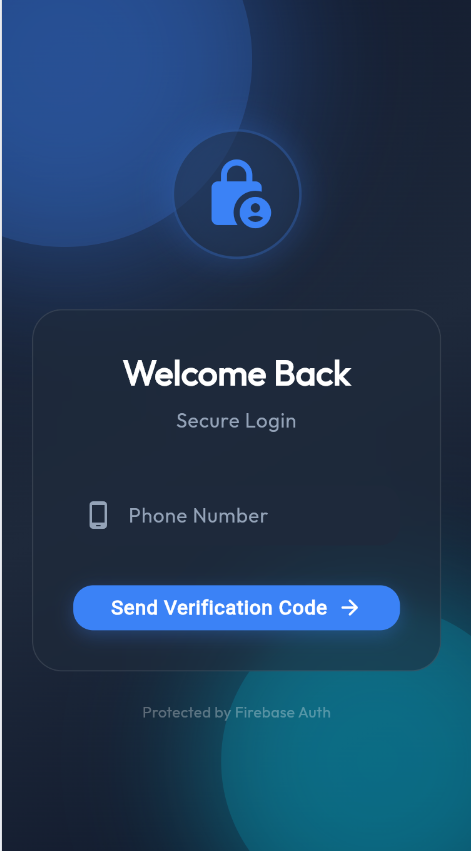
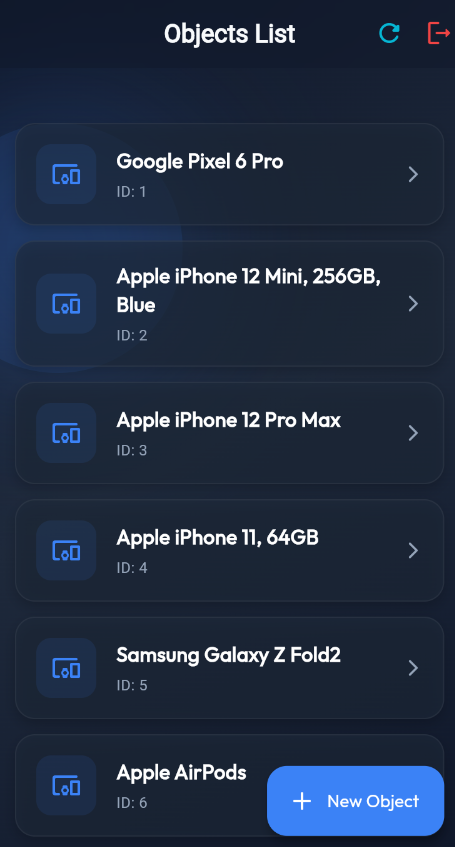
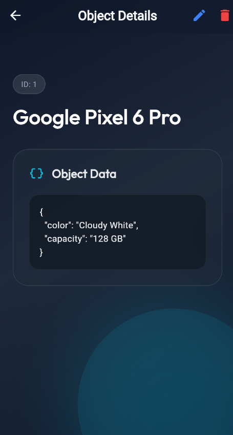
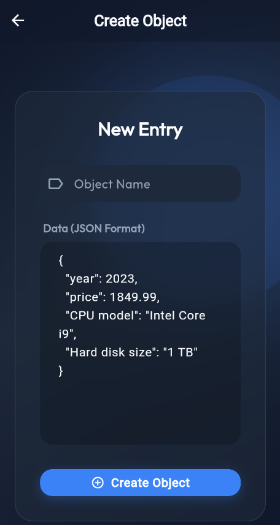
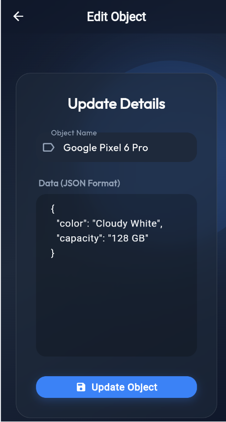

# Flutter GetX Cross-Platform App

A production-ready Flutter application (Mobile & Web) featuring Firebase Phone Authentication, REST API integration with Clean Architecture, and GetX for state management.

## Features

- **Authentication**: Firebase Phone OTP Login (Web & Mobile) with reCAPTCHA support.
- **State Management**: GetX for reactive state, dependency injection, and route management.
- **API Integration**: Full CRUD operations on `https://api.restful-api.dev/objects`.
- **Architecture**: Clean Architecture (Presentation, Domain, Data layers).
- **UI/UX**: Material 3 Design, Dark/Light mode support, Responsive layout, Loading states, Optimistic UI updates.
- **Testing**: Unit tests for API Service and Controllers.

## Project Structure

```
lib/
├── controllers/    # GetX Controllers (State Management)
├── models/         # Data Models
├── repositories/   # Data Repositories (Abstraction)
├── routes/         # Route Definitions
├── services/       # API Services (HTTP Client)
├── utils/          # Utilities (Validators, etc.)
├── views/          # UI Screens (Widgets)
└── main.dart       # Entry Point
```

## Setup & Configuration

### Prerequisites
- Flutter SDK (Stable Channel)
- Firebase CLI (`npm install -g firebase-tools`)
- Android Studio / VS Code

### 1. Firebase Setup
This project requires Firebase configuration for Phone Authentication.

1.  Create a new Firebase project at [console.firebase.google.com](https://console.firebase.google.com).
2.  **Enable Authentication**: Go to Build > Authentication > Sign-in method > Phone. Enable it.
3.  **Add Test Numbers**: Add a test phone number (e.g., `+1 123 456 7890`) and verification code (e.g., `123456`) in the Phone Auth settings.
4.  **Configure Apps**:
    *   Run `flutterfire configure` in the project root.
    *   Select your project and platforms (Android, Web, iOS).
    *   This will generate `lib/firebase_options.dart`.

**Android Specifics**:
- You must add your SHA-1 and SHA-256 fingerprints to the Firebase Android App settings.
- Run `cd android && ./gradlew signingReport` to get your SHA keys.

**Web Specifics**:
- No extra setup usually needed for reCAPTCHA v3 (invisible) if using `flutterfire configure`.
- Ensure your domain (localhost or hosted URL) is added to Authorized Domains in Firebase Auth settings.

### 2. Dependencies
Run `flutter pub get` to install dependencies listed in `pubspec.yaml`.

## Running the App

### Development
```bash
# Run on Android Emulator/Device
flutter run

# Run on Chrome
flutter run -d chrome
```

### Testing
Run unit tests:
```bash
flutter test
```
*Note: You may need to run `dart run build_runner build` to generate mock files for tests.*

## Deployment

### Web (Firebase Hosting)
See [DEPLOY.md](DEPLOY.md) for detailed instructions.

### Android (APK)
```bash
flutter build apk --release
```
The APK will be located at `build/app/outputs/flutter-apk/app-release.apk`.

## Known Limitations & Future Improvements
- **Pagination**: The current API returns all objects. Client-side pagination is simulated. Future improvement: Implement server-side pagination if API supports it.
- **Error Handling**: Basic snackbars are used. Future: Implement more granular error dialogs and retry mechanisms.
- **Offline Mode**: Currently requires internet. Future: Implement local caching with Hive or SQLite.

## Screenshots

<div align="center">
  
  
  
  
  
  
</div>

## Walkthrough Checklist
- [ ] Login with Test Phone Number (+916301123051 / 123456).
- [ ] Verify OTP and navigate to Home.
- [ ] Scroll through the list of objects.
- [ ] Create a new object with JSON validation.
- [ ] View details of the created object.
- [ ] Edit the object.
- [ ] Delete the object (observe optimistic UI).
- [ ] Logout.
